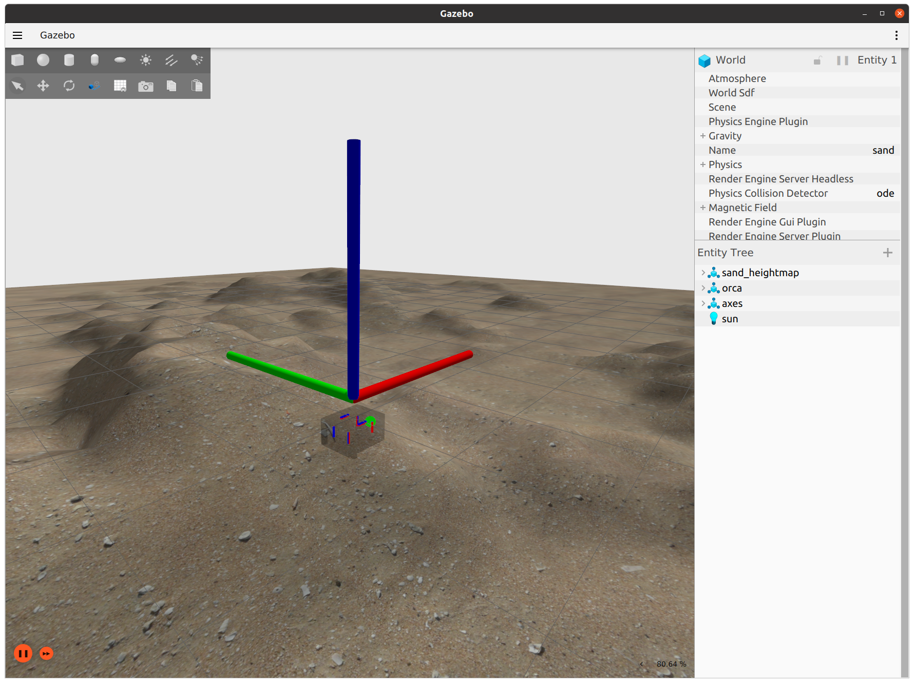

# Orca4 

Orca4 is a set of [ROS2](http://www.ros.org/) packages that provide basic AUV (Autonomous Underwater
Vehicle) functionality for the [BlueRobotics BlueROV2](https://www.bluerobotics.com).

Orca4 uses [ArduSub](http://www.ardusub.com/) as the flight controller and
[mavros](https://github.com/mavlink/mavros) as the GCS.

Orca4 runs in [Gazebo Garden](https://gazebosim.org/home) using the standard buoyancy, hydrodynamics and thruster
plugins. The connection between ArduSub and Gazebo is provided by [ardupilot_gazebo](https://github.com/ArduPilot/ardupilot_gazebo).

## Sensors

The BlueROV2 provides the following interesting sensors:
* An [external barometer](https://bluerobotics.com/product-category/sensors-sonars-cameras/sensors/) provides depth
* An IMU provides attitude

Orca4 adds a simulated down-facing stereo camera and [ORB_SLAM2](https://github.com/clydemcqueen/orb_slam_2_ros/tree/orca4_galactic)
to generate a 3D pose as long as the camera has a good view of the seafloor.
The pose is sent to ArduSub and fused with the other sensor information.

If there is no view of the seafloor a synthetic pose is generated based on the last good pose and a simple motion model.

See [orca_base](orca_base/README.md) for details.

## Navigation

Orca4 uses the [Navigation2](https://navigation.ros.org/index.html) framework for mission
planning and navigation. Several simple Nav2 plugins are provided to work in a 3D environment:
* straight_line_planner_3d
* pure_pursuit_3d
* progress_checker_3d
* goal_checker_3d 

See [orca_nav2](orca_nav2/README.md) for details.

## Installation

See the [Dockerfile](docker/Dockerfile) for installation details.

Install these packages:
* [ROS2 Humble](https://docs.ros.org/en/humble/Installation.html)
* [Gazebo Garden 7.1.0](https://gazebosim.org/docs/garden/install)
* [ardupilot_gazebo](https://github.com/ArduPilot/ardupilot_gazebo)
* [ArduSub](https://ardupilot.org/dev/docs/building-setup-linux.html)

Build ArduSub for SITL:
~~~
cd ~/ardupilot
./waf configure --board sitl
./waf sub
~~~

Populate the workspace:
~~~
mkdir -p ~/colcon_ws/src
cd colcon_ws/src
git clone https://github.com/clydemcqueen/orca4
vcs import < orca4/workspace.repos
~~~

Build ros_gz for Garden, not Fortress:
~~~
export GZ_VERSION=garden
~~~

Get dependencies, ignoring Gazebo Garden rosdep keys:
~~~
rosdep update
rosdep install -y --from-paths . --ignore-src --skip-keys="gz-transport12 gz-sim7 gz-math7 gz-msgs9"
~~~

MAVROS depends on GeographicLib, and GeographicLib needs some datasets:
~~~
sudo mavros/mavros/scripts/install_geographiclib_datasets.sh
~~~

Build the workspace:
~~~
cd ~/colcon_ws
colcon build
~~~

## Simulation

In a terminal run:
~~~
source src/orca4/setup.bash
ros2 launch orca_bringup sim_launch.py
~~~

This will bring up all of the components, including the Gazebo UI.
The surface of the water is at Z=0 and the sub will be sitting at the surface.
The world contains a sandy seafloor 10 meters below the surface.

You should see ArduSub establish a connection to the ardupilot_gazebo plugin:
~~~
[ardusub-2] JSON received:
[ardusub-2] 	timestamp
[ardusub-2] 	imu: gyro
[ardusub-2] 	imu: accel_body
[ardusub-2] 	position
[ardusub-2] 	quaternion
[ardusub-2] 	velocity
~~~

At this point SLAM is not running because the seafloor is too far away,
but the sub can still move using dead-reckoning.
The [base_controller](orca_base/src/base_controller.cpp) node will send default camera poses to ArduSub
to warm up the EKF and the [manager](orca_base/src/manager.cpp) node will request attitude information at 20Hz.
Initialization completes when there is a good pose from the EKF:

~~~
[mavros_node-8] [INFO] [mavros.imu/handle_attitude_quaternion]: IMU: Attitude quaternion IMU detected!
[manager-9] [INFO] [manager/operator()]: EKF is running
[base_controller-10] [INFO] [base_controller/change_state]: EKF is running, state => RUN_NO_MAP
[base_controller-10] [INFO] [base_controller/UnderwaterMotion]: initialize odometry to {{-2.52304e-05, -3.28182e-05, -0.228547}, {0, 0, -5.00936e-05}}
~~~

Execute a mission in a second terminal:
~~~
source src/orca4/setup.bash
ros2 run orca_bringup mission_runner.py
~~~ 

The default mission will dive to -7m and move in a large rectangle.
At -6m the cameras will pick up a view of the seafloor at and ORB_SLAM2 will start:
~~~
[orb_slam2_ros_stereo-13] New map created with 571 points
[base_controller-10] [INFO] [base_controller/change_state]: map created, state => RUN_LOCALIZED
~~~

You should notice a loop closure sometime during the 2nd run around the rectangle. The adjustment is very small.

~~~
[orb_slam2_ros_stereo-13] Loop detected!
[orb_slam2_ros_stereo-13] Local Mapping STOP
[orb_slam2_ros_stereo-13] Local Mapping RELEASE
[orb_slam2_ros_stereo-13] Starting Global Bundle Adjustment
[orb_slam2_ros_stereo-13] Global Bundle Adjustment finished
[orb_slam2_ros_stereo-13] Updating map ...
[orb_slam2_ros_stereo-13] Local Mapping STOP
[orb_slam2_ros_stereo-13] Local Mapping RELEASE
[orb_slam2_ros_stereo-13] Map updated!
~~~

## Packages

* [`orca_base` Base controller, localization, frames](orca_base)
* [`orca_bringup` Launch files](orca_bringup)
* [`orca_description` SDF files](orca_description)
* [`orca_msgs` Custom messages](orca_msgs)
* [`orca_nav2` Nav2 plugins](orca_nav2)
* [`orca_shared` Dynamics model, shared utilities](orca_shared)
